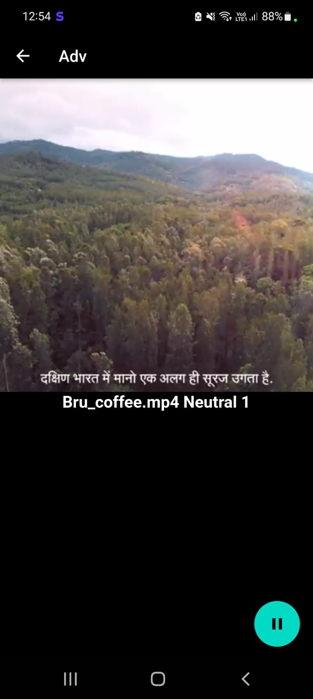

<h1 align="center">
  <a href="https://github.com/ananya-bangera/Msft-project">
    
  </a>
  <br>
  AdvertAIse 📲
</h1>

<div align="center">
  A <strong>platform</strong> for companies to utilize <strong>smart advertising</strong> techniques to <strong>analyze and improve</strong> their advertisements based on <strong>user inputs</strong>  <br>
  <a href="https://acehacker.com/microsoft/engage2022/">Microsoft Engage 2022</a> <br> <br>
  
</div>
<hr>

<details>
<summary>Table of Contents</summary>

- [💭Problem Statement](#problem-statement)
- [📰Description](#description)
- [🔗Resources](#resources)
- [🤖Tech-Stack](#tech-stack)
- [📈Progress](#progress)
- [🔮Future Scope](#future-scope)
- [🚧Major Roadblocks](#major-roadblocks)
- [⚙Usage](#usage)
- [👨‍💻Contributors](#contributors)
- [👨‍🏫Acknowledgement](#acknowledgement)
- [📱Screenshots](#screenshots)

</details>

## 💭Problem Statement
Develop a browser-based application or a native mobile application to demonstrate application of Face Recognition technology in the area of smart advertising.

## 📰Description
<table>
  <tr>
    <td>
      The <strong>AdvertAIse</strong> mobile application will act as a platform for the companies to utilise smart advertising techniques to analyse and improve their advertisements based on user inputs. 
      The generalised data will help them to get a clear idea of places where work is needed. 
      This will help them to make their advertisements more engaging thereby ensuring a better and effective reach of their advertisement. 
      The focus is on providing overall suggestions as in features liked by most of the users and places where improvement is required.
    <br>
    <h3>Use Cases</h3>   
    The Flutter-based app has two access levels :
    <ol>
    <li>Company</li>
    <li>User</li>
    </ol>
    <h4>1. Company</h4>
    <p>
    <ul>
    <li>The companies can post the videos to promote their products</li>
    <li>The analysis of data i.e of emotions of users will be tracked via an <strong>Emotion Detection System</strong> at various timestamps of the advertisement.</li>
    <li>Generalised data will be sent to the respective company’s Dashboard wherein a complete analysis will be displayed.</li>
    <li>This app will serve as a survey with input being fed by the recognition system which can further be helpful for the marketing team of the company to categorize the 
    features to be ameliorated and those to be abolished.</li>
    </ul>
    </p>
    <h4>2. User</h4>
    <p>
    <ul>
    <li>The users can view the videos posted by the companies</li>
    <li>The rewards will be provided by the company to the users depending on the  advertisements watched by them which can be redeemed</li>
    <li>Also apart from these rewards user ranking will be provided on basis of the number of advertisements watched</li>
    <li>The interface provides users with a gamified environment </li>
    </ul>
    </p>
    <h3>Business Potential</h3>
    <p>
    <ul>
    <li>The companies can be charged some fee for using the platform. </li>
    <li>The users can be provided coins, coupons, and discounts by the participating companies</li>
    </ul>
    </p>
  </td>
 </tr>
</table>

## 🔗Resources
- [GitHub Repository](https://github.com/ananya-bangera/Msft-project)
- [APK File](https://drive.google.com/drive/folders/17_rcEcp332EcuV5EV56v7NPeM7c8dvcp?usp=sharing)
- [Documents-UML Use Case Diagram, PPT & Process Flow Chart](https://drive.google.com/drive/folders/12pILLqwV-JuZd3q_nJBuwFiE9rygRqG6?usp=sharing)
- [Screenshots](https://drive.google.com/drive/folders/1YZMpvXM0elyQD16z3-4FtwkxDxa7AoVI?usp=sharing)
- [Demo Video](https://youtu.be/TQ8fPB1fh5Q)
- [Figma Designs](https://www.figma.com/file/JRvXBmStKHIcLepytgANr9/Smart-Advertising?node-id=0%3A1)

## 🤖Tech-Stack
<a href="https://flutter.dev/" title="Flutter"></a>
<a href="https://dart.dev/" title="Dart"></a>
<a href="https://www.figma.com/" title="Figma"></a>
<a href="https://www.tensorflow.org/" title="Tensorflow"></a>
<a href="https://firebase.google.com/" title="Firebase"></a>
<a href="https://teachablemachine.withgoogle.com/" title="Teachable Machine"></a>
<a href="https://developer.android.com/" title="Android"></a>

## 📈Progress
- [x] 2 Access Levels Implemented using Firebase Auth - User & Company
- [x] Videos Added by company stored in Firebase Storage
- [x] Videos sorted by categories
- [x] Figma Designs for the UI created
- [x] UI implemented in Flutter  
- [x] Emotion Detection Model trained on Teachable Machine, TfLite file generated
- [x] Model Integrated with Flutter using the `tflite` package   
- [x] Timestamp-based records of emotions stored in Firebase Database
- [x] Analytics Graphs(Bar Charts and Pie Charts) for uploaded videos

## 🔮Future Scope
- Add a gamified environment for the users
- Introduce ranking system and leaderboards
- Allow users to redeem and apply coupons based on their scores
- Allow companies to run special campaigns

## 🚧Major Roadblocks
1. Dart Version Conflict with Firebase Dependencies
   ```
   The current Dart SDK version is 2.13.1.
   Because smart_advertising depends on cloud_firestore >=3.1.10 which requires SDK version >=2.16.0 <3.0.0, version solving failed.
    pub get failed (1; Because smart_advertising depends on cloud_firestore >=3.1.10 which requires SDK version >=2.16.0 <3.0.0, version solving failed.)
    Process finished with exit code 1
   ```
   Solved by using version suitable to my current SDK version
2. BuildContext Error
   ```
   error: [dart] The argument type 'Context' can't be assigned to the parameter type 'BuildContext'. [argument_type_not_assignable]
   ```
   By passing the BuildContext context or Just context in the function helped me solved the problem 
3. Missing Firebase Dependency
   ```
   lib/pages/registeration.dart:252:21: Warning: Operand of null-aware operation '!' has type 'User' which excludes null.
     - 'User' is from 'package:firebase_auth/firebase_auth.dart' ('/C:/src/flutter/.pub-cache/hosted/pub.dartlang.org/firebase_auth-2.0.0/lib/firebase_auth.dart').
    userModel.uid = user!.uid;
    /C:/src/flutter/.pub-cache/hosted/pub.dartlang.org/cloud_firestore_platform_interface-5.5.0/lib/src/method_channel/method_channel_firestore.dart:112:15: Error: Method not found: 'Error.throwWithStackTrace'.
            Error.throwWithStackTrace(
    ^^^^^^^^^^^^^^^^^^^
    /C:/src/flutter/.pub-cache/hosted/pub.dartlang.org/cloud_firestore_platform_interface-5.5.0/lib/src/method_channel/utils/exception.dart:14:11: Error: Method not found: 'Error.throwWithStackTrace'.
        Error.throwWithStackTrace(exception, stackTrace);
   ```
   Solved by adding the dependency firebase_auth_platform_interface: ^5.0.0
4. Null value Error - a frequent error
   ```
   Flutter Compile Error on Firebase Auth: "A non-null value must be returned since the return type 'Never' doesn't allow null."
   ```
   Solution:  
   The error message was added from dart 2.16, i.e from flutter 2.10, so the primary solution will be to upgrade your flutter version, which will also upgrade dart version.
   ```
   android{
           //change compile sdk version to 31
           compileSdkVersion 31
    }
    ```
 5. MultiDex Error
    ```
    D8: Cannot fit requested classes in a single dex file 
    ```
    Add multiDex to your app-level build.gradle file. Under defaultConfig add this line
    ```
    multiDexEnabled true
    ```
    Then in dependencies add multidex and check versions
    ```
    implementation 'androidx.multidex:multidex: 2.0.1'
    ```
6. TFLite embedding not supported for Android V2
   ```
   The plugin `tflite` uses a deprecated version of the Android embedding.
    To avoid unexpected runtime failures, or future build failures, try to see if this plugin supports the Android V2 embedding. Otherwise, consider removing it since a future release of Flutter will remove these deprecated APIs.
    If you are plugin author, take a look at the docs for migrating the plugin to the V2 embedding: https://flutter.dev/go/android-plugin-migration.
   ```
   Solved by referencing a GitHub repo which updated the TFLite package
7. Use of async/await from Builder
   ```
   type 'Future<dynamic>' is not a subtype of type 'List<String>'
   ```
   Solution:   
   You cannot use async/await when returning from a build method (or a builder closure). Any time you have async when building the widget tree, it's best to use a FutureBuilder

## 🛠Project Setup
1. Clone the GitHub repo
  ```
  git clone https://github.com/ananya-bangera/Msft-project.git
  ```
2. Load the project in Android Studio
3. Download all the packages listed in `pubspec.yaml` using `pub get` command
4. Integrate with your Firebase Project by adding your Firebase keys

## ⚙Usage
Based on your Android Development environment, proceed for a Gradle Build to debug and run the app in development mode.

## 👨‍💻Contributors
- [Ananya Bangera](https://www.linkedin.com/in/ananya-bangera-1647a9207/) - [ananya.bangera100@gmail.com](mailto:ananya.bangera100@gmail.com)

## 👨‍🏫Acknowledgement
- Mentor - [Naveen Luhach](https://www.linkedin.com/in/naveenluhach/)
- [Microsoft Engage 2022](https://acehacker.com/microsoft/engage2022/)

## 📱Screenshots
<p align="middle">
   <br>
<table>
  <tr>
    <td><b>REGISTER </b></td>
     <td><b>HOMEPAGE </b></td>
  </tr>
  <tr>
    <td> </td>
    <td></td>
  </tr>
 </table>
 <br>

<br>
<b></b>
 <br>
    <br>
<table>
  <tr>
    <td><b> BARCHART</b></td>
     <td><b>PIECHART </b></td>
  </tr>
  <tr>
    <td> </td>
    <td></td>
  </tr>
 </table>
 <br>

<br>
<b></b>
 <br>
    <br>
<table>
  <tr>
    <td><b> UPLOADVIDEO</b></td>
     <td><b>DISPLAYVIDEO </b></td>
  </tr>
  <tr>
    <td></td>
    <td></td>
  </tr>
 </table>
 <br>

<br>
<b></b>
 <br>
 
   


